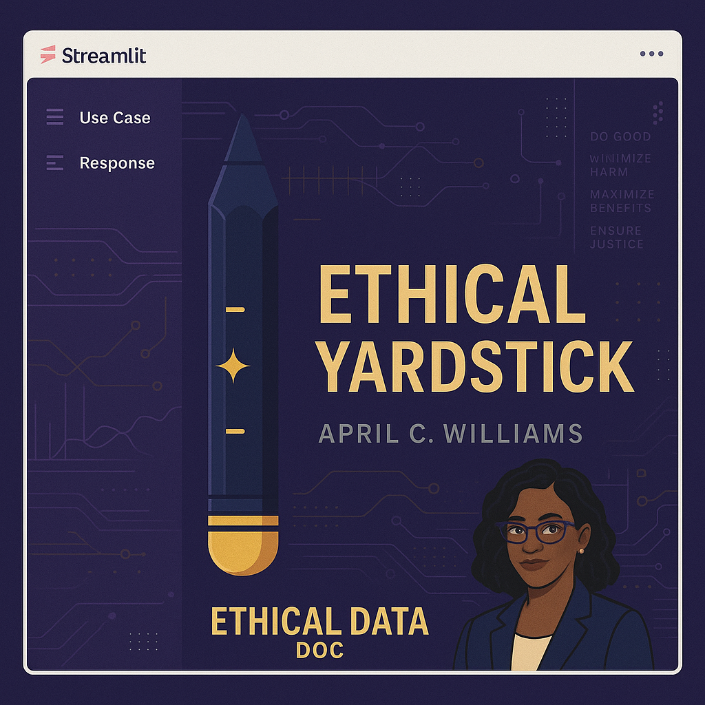

# 🧭 Do No Harm: Ethical Yardstick

This Streamlit app helps evaluate the ethical implications of data and AI use cases using a rubric based on the "Do No Harm" framework.

## Features
- Input a use case and system response
- Score response across five ethical dimensions:
  - Justice & Equity
  - Transparency & Trust
  - Accountability
  - Respect for Persons
  - Non-Maleficence
- Provide justification for each score
- Visualize results using an ethical yardstick (color-coded bar chart)
- Save and review historical evaluations

## How to Use

1. Clone the repo or download ZIP
2. Install requirements:
    ```bash
    pip install streamlit pandas matplotlib
    ```
3. Run the app:
    ```bash
    streamlit run app.py
    ```

---

Created by April C. Williams, the Ethical Data Doc
